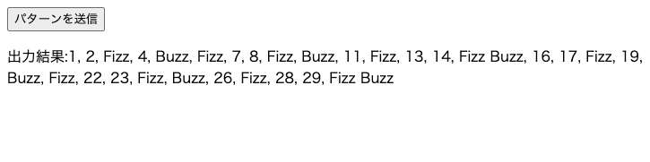

# Webコーディングテスト

本問題はWebサーバーにおける基本的な知識とアルゴリズムを問うコーディング演習である。以下の「問題」と「解答の提出」をよく読んで、解答してください。

制限時間はありませんが、解答時間は採点の基準の一つになります。提出gitの最終commit時間を解答終了時間として採点致しますので、最終提出後は変更のないようご注意ください。

## 問題

FizzBuzzの拡張として下記のようなパターンをAPIサーバーにPOSTします。送信されたパターンに応じて、入力を1から30としたときの出力をブラウザに表示するWebアプリケーションを完成させてください。

- データは必ずjson形式で渡されます。パターンのキーは必ず`"obj"`です。
- `"num"`キーは必ず小さい順にソートされています。

```json
{
    "obj":
        [
            { "num": 4, "text": "fizz" },
            { "num": 7, "text": "buzz" },
            { "num": 8, "text": "hoge" },
            { "num": 15, "text": "huga" }
        ]
}
```

### FizzBuzzとは
FizzBuzzというプログラムは、3の倍数が入力されると”Fizz”を出力し、5の倍数が入力されると”Buzz”を出力し、3の倍数でも5の倍数でもある数が入力されると”FizzBuzz”を出力します。
3の倍数でも5の倍数でもない数が入力されるとその数字をそのまま出力します。


## 入出力例
### 入力

```json
{
    "obj":
        [
            { "num": 3, "text": "Fizz" },
            { "num": 5, "text": "Buzz" }
        ]
}

```

### 出力

```
1, 2, Fizz, 4, Buzz, Fizz, 7, 8, Fizz, Buzz, 11, Fizz, 13, 14, Fizz Buzz, 16, 17, Fizz, 19, Buzz, Fizz, 22, 23, Fizz, Buzz, 26, Fizz, 28, 29, Fizz Buzz
```
#### Webアプリケーション完成イメージ
「パターンを送信」をクリックすると下図のように結果が表示されます。

## 回答の始めかた
### PHPでの回答の始めかた
- 下記コマンドを実行し、phpサーバーを立ち上げる
```bash
git clone git@github.com:y0he1/avilen-web-codingtest.git
cd avilen-web-codingtest
php -S localhost:8080 ./php/index.php 
```
- http://localhost:8080/start にアクセスしてアプリケーションのフロント画面にアクセスしてサーバーが立ち上がっていることを確認
- `./php/index.php`を編集して回答をスタート

### node.jsでの回答の始めかた
- 下記コマンドを実行し、nodeサーバーを立ち上げる
```bash
git clone git@github.com:y0he1/avilen-web-codingtest.git
cd avilen-web-codingtest
node ./node/index.js
```
- http://localhost:8080/start にアクセスしてアプリケーションのフロント画面にアクセスしてサーバーが立ち上がっていることを確認
- `./node/index.js`を編集して回答をスタート

## 回答の提出

- 回答のプログラムはphpかnode.jsのどちらかの言語を利用して記述してください。
- phpで回答する方は`php/index.php`を、node.jsで回答される方は`node/index.js`を編集して提出してください。
- `index.html`は変更してはいけません。
- 回答を **ご自身の** 公開gitレポジトリにプッシュしてください。(githubでも構いません)
- 以下のリンクにある回答提出フォームに従い、ブラウザに表示したプログラムの出力とgitリポジトリのurlを提出してください。
(https://forms.gle/YPgik7KbigP2AJ3t6)